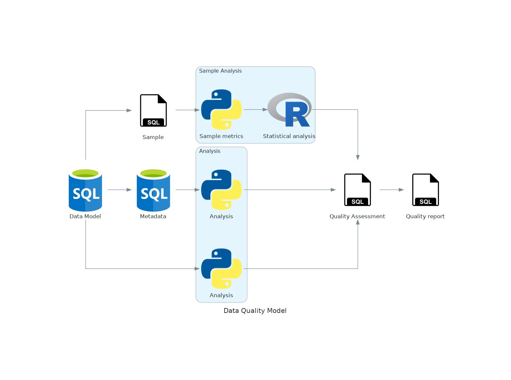

# Data Quality assessment model

## Introduction
There are two ways to measure data quality - subjective and objective. Objective measures should be independent of data and usage, thanks to that this option is way more generic.
Proposed solution merges both ideas, so part of it can be used without knowing anything about the data, the other part requires EDA and overall data knowledge.

The diagram denotes overall pipeline how to use this solution:

Metadata and sample are created programatically based on the data. There might be a need for permission elevation to automatically run whole project.

## Used dimensions and metrics
The metadata plays an important role in the quality assessment, it works as a link between data and DQ model. This is the part of objective DQ, it can be used for measuring other database qualities as well. Based on the metadata there is a calculation for overall schema quality assessment, taking into account:
- Empty tables
- "Metadata as data"
- Wide tables
- Lacking relations
- [Indexes] <- optional
Every feature gets calculated with formula, using weights:
1. Empty Tables:

2. Metadata as data means that table consists of just a bunch of foreign keys

3. Lacking relations - these are attributes present in various entities not marked as foreign keys and marked as a primary key in a 'source' entity. 

### Dimensions:
1. Completness